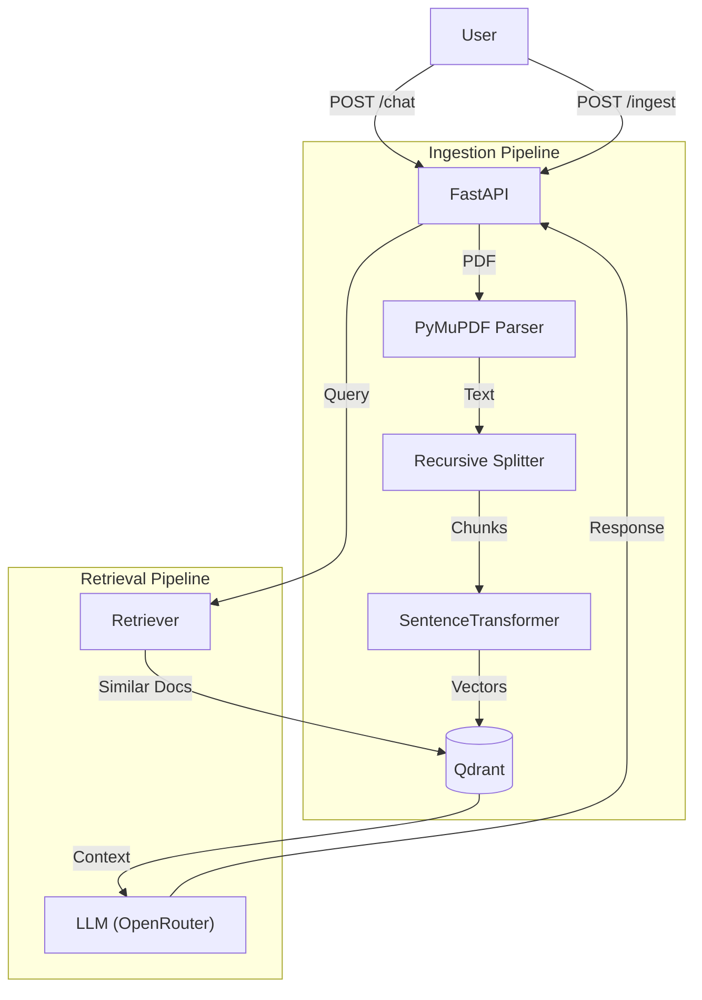

# Production RAG AI Chat Agent

A production-grade retrieval augmented generation (RAG) system built with FastAPI, LangChain, Qdrant, and OpenRouter. This project demonstrates a scalable, containerized architecture for ingesting PDF documents and performing context-aware chat operations.

## 🚀 Tech Stack

- **Framework:** FastAPI (Python 3.11)
- **Orchestration:** LangChain
- **Vector Store:** Qdrant
- **LLM Provider:** OpenRouter (Google Gemma 3 27B)
- **Embeddings:** sentence-transformers (all-MiniLM-L6-v2)
- **Containerization:** Docker & Docker Compose

## 🏗️ Architecture Overview

The system follows a microservices-ready architecture with separate pipelines for ingestion and retrieval.



### Data Flow

1. **Ingest**: PDF → PyMuPDF Parse → Chunking (RecursiveCharacterTextSplitter) → Embed (all-MiniLM-L6-v2) → Hash (SHA256 dedup) → Qdrant Upsert.
2. **Query**: User Query → Embed Query → Qdrant Similarity Search → Top-K Chunks → Prompt Template → OpenRouter (Gemma-3-27B) → Response.

## 📂 Project Structure

```
rag-agent/
├── app/
│   ├── api/             # FastAPI routes & dependencies
│   ├── core/            # Config & logging
│   ├── pipelines/       # Ingest & RAG logic
│   ├── services/        # Core business logic (parser, embedder, vector_store)
│   ├── schemas/         # Pydantic models
│   ├── main.py          # Entrypoint
│   └── Dockerfile
├── qdrant_storage/      # Persisted vector data
├── docker-compose.yml
├── .env.example
└── README.md
```

## 🛠️ Setup & Installation

### Prerequisites

- Docker & Docker Compose
- OpenAI/OpenRouter API Key

### 1. Clone & Configure

```bash
# Clone the repository
git clone https://github.com/yourusername/ragagent.git
cd ragagent

# Configure environment variables
cp .env.example .env
```

Edit `.env` and add your API key:

```ini
OPENROUTER_API_KEY=your_key_here
```

### 2. Build & Run

```bash
docker compose up --build -d
```

The API will be available at `http://localhost:8000`.

## 📖 Usage

### API Documentation

Swagger UI is available at: http://localhost:8000/docs

### 1. Ingest a Document

Upload a PDF file to the vector store.

```bash
curl -X POST http://localhost:8000/api/v1/ingest \
  -F "file=@/path/to/your/document.pdf"
```

**Response:**

```json
{
  "filename": "document.pdf",
  "doc_hash": "a3f5c2...",
  "total_chunks": 42,
  "message": "Document ingested successfully."
}
```

### 2. Chat with Documents

Ask questions based on ingested content.

```bash
curl -X POST http://localhost:8000/api/v1/chat \
  -H "Content-Type: application/json" \
  -d '{"question": "What is the main topic of this document?"}'
```

**Response:**

```json
{
  "answer": "Based on the document, the main topic is...",
  "sources": [{ "filename": "document.pdf", "score": 0.923 }]
}
```

## ⚡ Key Design Decisions

| Decision             | Reasoning                                                                             |
| -------------------- | ------------------------------------------------------------------------------------- |
| **all-MiniLM-L6-v2** | Fast, lightweight (384-dim), runs fully local without API costs.                      |
| **SHA256 Hashing**   | Prevents re-indexing duplicate content at both document and chunk levels.             |
| **Qdrant**           | Chosen over FAISS for persistence, production readiness, and easy API access.         |
| **OpenRouter**       | Provides access to top-tier models (like Gemma 3 27B) without local GPU requirements. |
| **LRU Caching**      | Applied to embedders and clients to avoid expensive re-initialization per request.    |
| **FastAPI Lifespan** | Ensures database connections and collections are ready before serving traffic.        |

## 🐳 Useful Docker Commands

```bash
# View logs
docker compose logs -f app

# Rebuild containers
docker compose up --build -d

# Stop services
docker compose down

# Nuclear reset (stops containers and deletes vector data)
docker compose down -v && rm -rf qdrant_storage/
```
